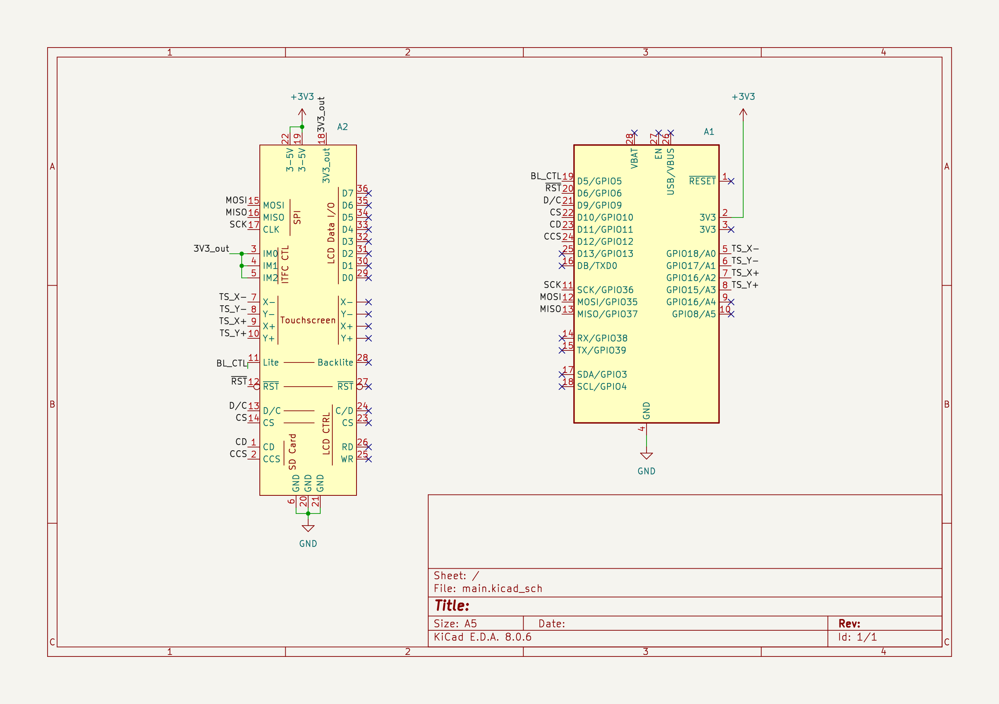

# c-graphic-calculator

Graphic calculator written in ESP32 C.

## What is the project?

This project is a calculator which is accessible from a touchscreen. The project is going to be solved using an ESP32 programmed in baremetal C and a touchscreen attached to this controller via 8080 parallel.
It will allow users to:

- Input numbers and calculate the results of those numbers based on the arithmetic operation they choose.
- Input functions and get an interactive graphic of those functions.
- Open a menu to select graphics mode or calculator mode.

## What is the MVP?

The Minimal Viable Product is a calculator that renders in a touchscreen that:

- Can perform addition, subtraction, multiplication and division operations based on a users input and show the user the result of that equation.
- Can render the graphic of an input function which can be moved and zoomed.

## What are the nice to haves?

The nice to haves for this project are:

- Styling the calculator.
- Having a dark and light theme.
- Being able to input multiple functions into one graphic.
- Being able to select a point of the ecuation and return its coordinates.

## When will the project be complete?

The project will be complete once all the MVP features have been implemented and the calculator has been styled.
